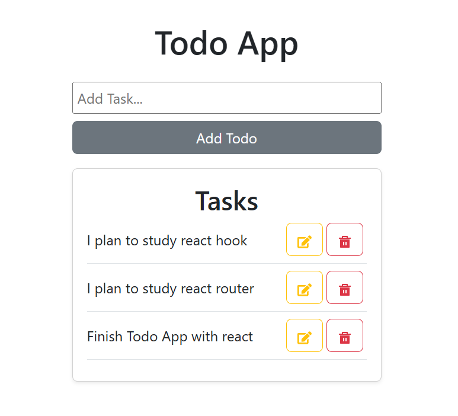
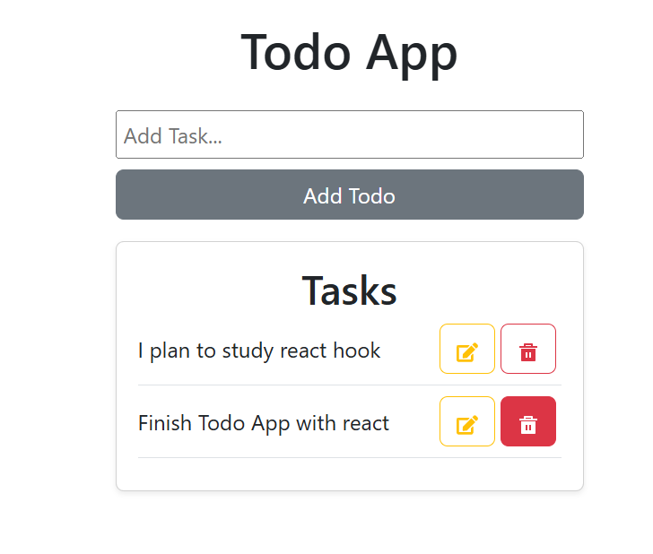
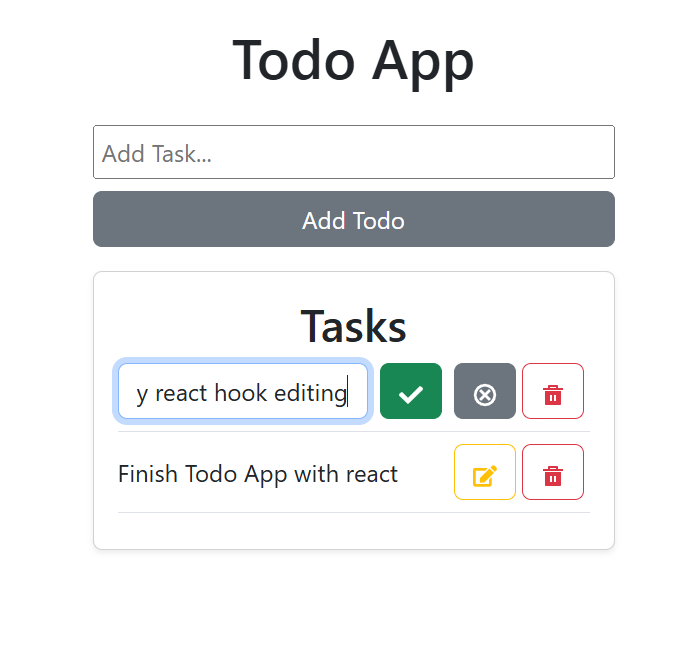

# React TypeScript To-Do App

An interactive To-Do list built using **React**, **TypeScript**, and **CSS**.

Users can:

---

##  Add New Tasks
- Type in the input field and click the **"Add Todo"** button to create a task.



---

##  Delete Tasks
- Click the **DELETE** icon to remove a task from the list.



---

##  Edit Existing Tasks
- Click the **Edit** icon to make a task editable.
- The button turns into **Save**, allowing you to store changes.



---

##  Tasks Persist on Refresh
- Tasks remain saved even after refreshing or reopening the page using **localStorage**.

---

##  How to Run the App

### 1. Clone the Repository

```bash
git clone https://github.com/meronsisay/react_todo_app.git
cd react_todo_app
npm install
npm run dev